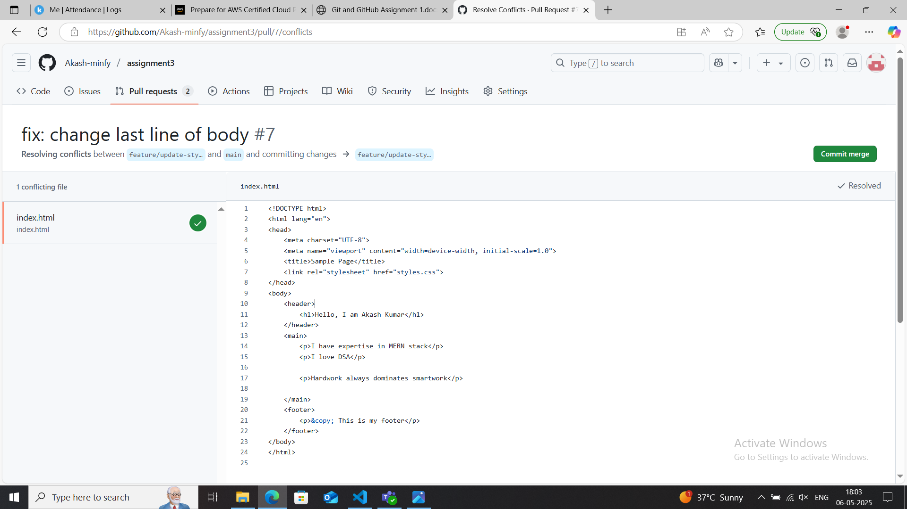

feature/update-style branch content  

feature/add-content branch content  

conflict screenshot  

#CONFLICT RESOLVING STEPS THAT I FOLLOWED- 
Opened the conflicted file in code editor to locate conflict markers (<<<<<<,======,>>>>>>) 
Observed the connflict and combined necessary parts from both branch 
cleaned file by deleting conflict markers (<<<<<<,======,>>>>>>) 

conflict Resolving screenshot  

conflict resolved screenshot 
